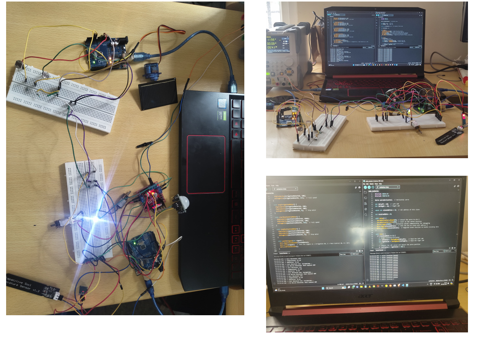

# 🌿 Voltorb Irrigation and Pest Detection

An intelligent Arduino-based system designed to **automate irrigation and pest control** in agricultural settings.  
It optimizes **water usage**, reduces **pesticide consumption**, and incorporates **solar tracking** for sustainable energy efficiency.

---

## 🧠 Overview

### 🎯 Objective
- Manage irrigation and pest control efficiently.
- Use real-time data to minimize waste and ensure healthy crop growth.
- Promote environmental sustainability using solar energy.

---

## ⚙️ System Architecture

### 🪴 Stage 1: Irrigation and Pest Control System
**Components:**
- PIR Sensor with Fresnel Lens – Detects pest motion.
- Soil Moisture Sensor – Monitors soil dryness.
- DHT11 Sensor – Tracks temperature and humidity.
- Motor Driver + Water Pump – Controls irrigation and pesticide spray.
- Buzzer – Repels pests via sound alert.

**Key Features:**
- Automatic watering when soil is dry.
- Pesticide spray activation when pests are detected.
- Smart irrigation control based on humidity.

---

### ☀️ Stage 2: Solar Tracking System
**Components:**
- LDR Sensors – Detect sunlight intensity.
- Servo Motor – Adjusts solar panel position.
- Solar Panel – (Future integration) for renewable energy.

**Functionality:**
- Tracks sunlight using dual LDR sensors.
- Adjusts panel position in real-time for maximum exposure.

---

### 🔗 Stage 3: I2C Communication
**Purpose:**  
Synchronizes two Arduino boards for coordinated operation.

**Master Arduino**
- Manages sensors (PIR, Soil Moisture, DHT11)
- Controls irrigation and pest control motors

**Slave Arduino**
- Handles solar tracking and ultrasonic buzzer
- Responds to commands from the master Arduino

---

## 💻 Code Files
- [`master_arduino.ino`](master_arduino.ino) — Handles irrigation, pest control, and environment monitoring.
- [`slave_arduino.ino`](slave_arduino.ino) — Manages solar tracking and ultrasonic buzzer.

---

## 🧩 Technologies Used
- Arduino UNO (x2)
- PIR Sensor
- Soil Moisture Sensor
- DHT11 Sensor
- LDRs
- Servo Motor
- Motor Driver
- I2C Communication

---

## ⚡ Problems Faced
- Limited lab access during internals.
- Component shortages (buzzers, solar mounts, pumps).
- Frequent dismantling due to shared lab resources.

---

## 👥 Team SVPS
| Name | Role |
|------|------|
| Shushrutha N Gowda | Lead Developer |
| Vismaya T V | Hardware Design |
| Pushpa R | Testing & Documentation |
| Sourav Kumar | Circuit Integration |

---

## 📄 Project Report

The full detailed report (with schematics, explanation, and code) is available here:  
📘 [View Full Project Report (PDF)](https://github.com/EmperorGonneBerserk/Voltorb-Irrigation-and-Pest-Detection/raw/main/Voltorb_Irrigation_and_Pest_Detection.pdf)

---

## 🏁 Future Enhancements
- Integrate solar power generation and battery storage.
- Add IoT dashboard for remote monitoring.
- Include AI-driven pest detection using camera input.

---

## 📜 License
This project is open-source under the [MIT License](LICENSE).

---

> Developed with 🌱 by Team SVPS for VOLTROB 2024.
